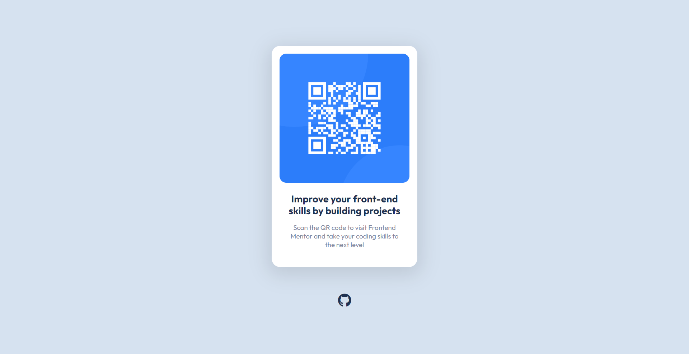

# QR Code Component

## Links

- [Challenge Link](https://www.frontendmentor.io/challenges/qr-code-component-iux_sIO_H)
- [Site Preview](https://robinjmm-qr-code.vercel.app/)

## About

This is my solution for the QR Code Component challenge from [Frontendmentor.io](https://frontendmentor.io).

## User Stories:

The user should be able to:

- View the optimal layout for the site depending on their device's screen size.

## Built With

- HTML5
- CSS3
- Sass
- PostCSS
- Vite

## Acknowledgement

I'm very grateful to the people at [Frontendmentor.io](https://frontendmentor.io) for providing designs and challenges
that help me improve my skills as a web developer.
