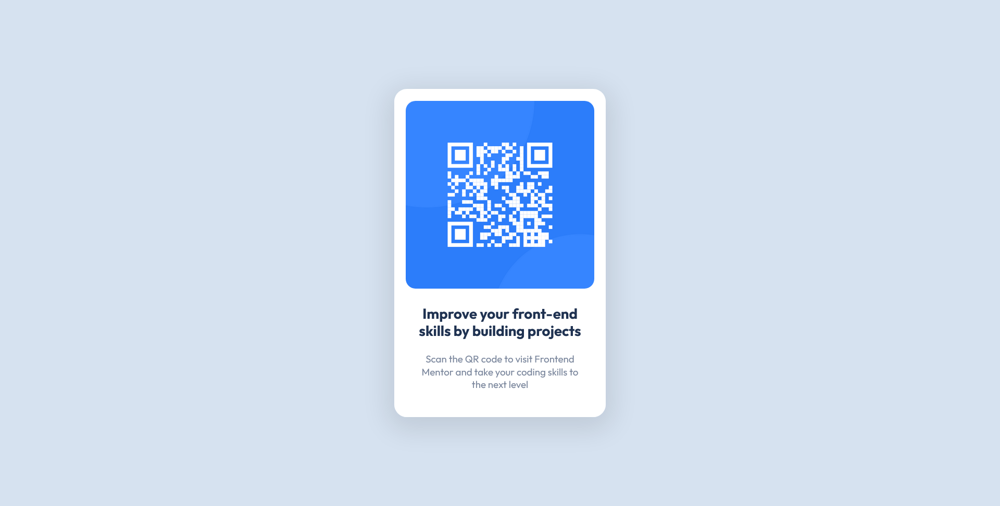

# QR Code Component


## Links
- [Challenge Link](https://www.frontendmentor.io/challenges/qr-code-component-iux_sIO_H)
- [Site Preview](https://robinjmm-qr-code-component.netlify.app)

## About
This is my solution for the challenge of building a QR Code component. The challenge is from [Frontendmentor.io](https://frontendmentor.io).

The goal for this challenge is to recreate a QR code component. The solution should be as close to the design as possible. Doing this project helped in polishing my HTML and CSS skills and in further improving my familiarity with Sass.

## User Stories:
The user should be able to:
- View the optimal layout for the site depending on their device's screen size.

## Built With
- Semantic HTML5
- CSS3
- Flexbox
- Sass

## Usage
You can download the project files by clicking on the green **Code** button, then select **Download Zip**.

Once you finish extracting, move into the project folder, open the terminal, and type the following code:

```
npm install
```

This will install all the required dependencies.

To compile Sass into CSS and watch for any future changes, type the following code in your terminal:


```
npm run sass
```

To compile Sass into a minified version of CSS, run:

```
npm run prod
```

## Acknowledgement
I'm very grateful to the people at [Frontendmentor.io](https://frontendmentor.io) for providing designs and challenges that help me improve my skills as a web developer.
